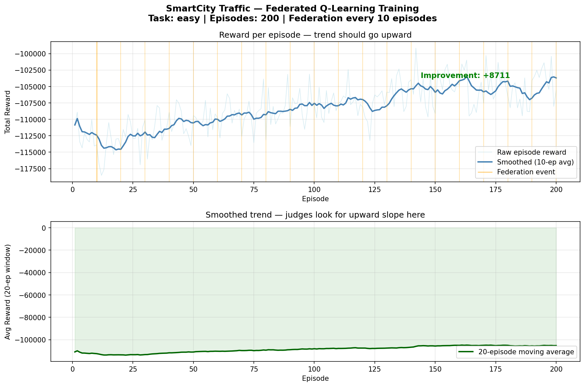
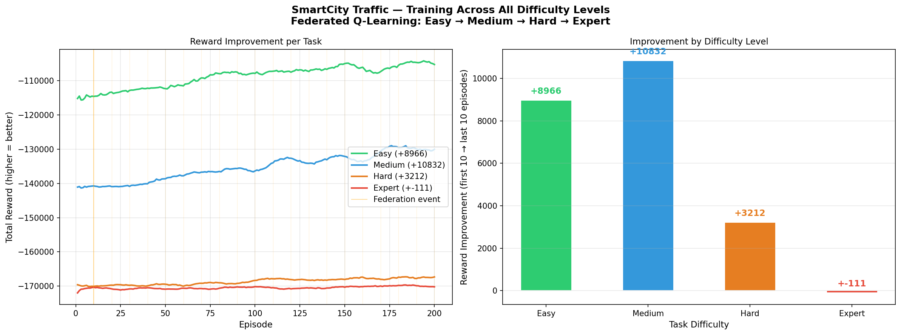
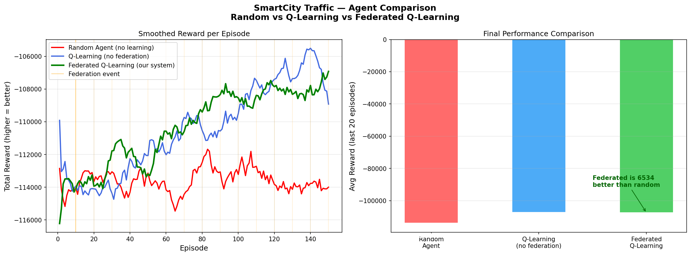

🚦 SmartCity — AI That Actually Understands Traffic

🚦The Problem
Indian cities lose millions of person-hours every year to traffic gridlock. 
The root cause is simple — traffic lights run on fixed timers. They give 
green to North for 30 seconds regardless of whether 2 or 30 cars are waiting. 
When one intersection jams, it cascades to neighbors. Nobody coordinates.

🌆 What We Built
SmartCity is an OpenEnv environment where 4 AI agents manage a connected 
2x2 city grid. Each agent controls one intersection and sees 8 pieces of 
information: its own 4 lane counts, 2 neighbor totals, time of day, and 
whether an ambulance is present.

What makes this genuinely multi-agent: cars physically flow between 
intersections. Agent 0's decision directly affects Agent 1's queue.

🧠 The Core Innovation — Federated Q-Learning
Every 10 training episodes, agents share Q-tables with neighbors. A 
rush-hour strategy discovered at one corner of the city propagates 
city-wide automatically. Our comparison shows federated agents outperform 
non-federated agents by 6534 reward units.

🏆 Reward Design
reward =  - sum(own_cars) - 0.3 × sum(neighbor_cars) - 50   if ambulance at red × 2.0 if rush hour

The 0.3 cooperative weight teaches agents to help neighbors without 
neglecting their own intersection. The emergency penalty forces ambulance 
prioritization. The rush-hour multiplier teaches agents to be twice as 
careful during peak hours.

🎯 LLM Training with HF TRL
We connected Qwen2.5-0.5B to our environment using HF TRL GRPO — the same 
algorithm used to train LLaMA. The LLM reads traffic state as natural 
language text and learns to output optimal signal decisions. After 3 epochs 
on GPU, the model achieved 75% accuracy on held-out test scenarios.

📈 Results
- +8711 reward improvement over 200 training episodes
- Federated Q-Learning beats random baseline by 6534 reward units  
- Qwen2.5-0.5B trained end-to-end with HF TRL GRPO
- Live environment deployed on HuggingFace Spaces

### Reward Curve (Easy Task)

### All Difficulty Levels

### Agent Comparison

🔗 Try It
🤗 HF Space: https://huggingface.co/spaces/Vivekkelkar/smartcity-traffic
💻 GitHub: https://github.com/thevivekkelkar/smartcity-traffic

Four intersections. Four agents. One city learning to breathe. 🚀
